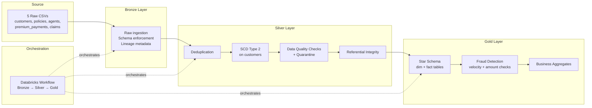
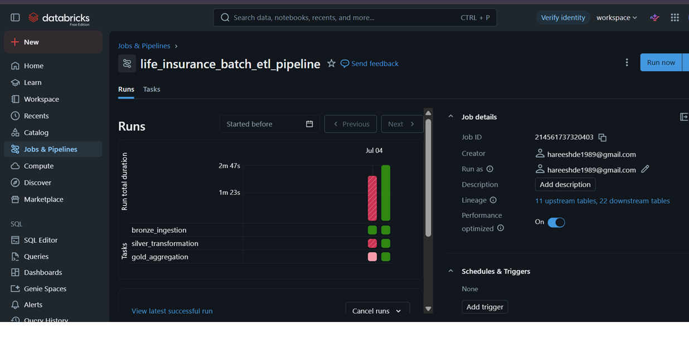
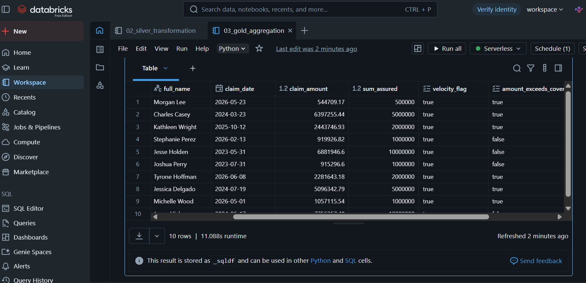

# Life Insurance Batch ETL Pipeline

A batch data engineering pipeline built with **PySpark**, **Delta Lake**, and **Databricks**, implementing the **Medallion Architecture** (Bronze → Silver → Gold) on a synthetic life insurance dataset.

This project was built to demonstrate hands-on, production-style data engineering skills as part of my transition into an Azure Data Engineer role, coming from a 4.4-year finance background.

---

## Architecture



---

## Tech Stack

| Component | Tool |
|---|---|
| Compute & Notebooks | Databricks (Free Edition) |
| Processing Engine | PySpark |
| Storage Format | Delta Lake |
| Orchestration | Databricks Workflows |
| Version Control | Git / GitHub |
| Data Generation | Python (Faker) |

---

## Dataset

Since real insurance data isn't publicly available at the granularity needed to demonstrate joins, SCD2, and data quality issues, I generated a **synthetic multi-table relational dataset** using Python, with realistic messiness intentionally injected:

| Table | Rows | Notes |
|---|---|---|
| `customers.csv` | ~4,400 | Includes SCD2 scenarios (address/email changes over time), duplicates, nulls |
| `policies.csv` | ~5,400 | Includes bad data: negative sum_assured, missing agent_id, invalid date ranges |
| `premium_payments.csv` | ~34,500 | Includes duplicate payments, negative amounts |
| `claims.csv` | ~840 | Includes injected fraud patterns (rapid repeat claims, claims exceeding cover) |
| `agents.csv` | 60 | Dimension table |

---

## Layer-by-Layer Breakdown

### 🥉 Bronze — Raw Ingestion (`notebooks/01_bronze_ingestion.py`)
- Explicit schema enforcement (no `inferSchema`) for production-grade reliability
- Lineage metadata columns: `_ingest_ts`, `_source_file`, `_batch_id`
- Append-only writes — Bronze is an immutable historical record
- Basic ingestion audit log

### 🥈 Silver — Cleaning & Conformance (`notebooks/02_silver_transformation.py`)
- **Deduplication** on natural + business keys
- **Slowly Changing Dimension Type 2** on `customers` — tracks full address/email history using `effective_date`, `end_date`, and `is_current`, implemented with an idempotent Delta `MERGE`
- **Data quality checks with quarantine** — invalid records (bad dates, negative amounts, missing foreign keys) are routed to separate `quarantine_*` tables rather than silently dropped, preserving auditability
- **Referential integrity** validation across policies, payments, and claims

### 🥇 Gold — Business-Ready Model (`notebooks/03_gold_aggregation.py`)
- **Star schema**: `dim_customer`, `dim_agent`, `dim_policy` + `fact_premium_payments`, `fact_claims`
- **Rule-based fraud detection** on claims:
  - Velocity check — multiple claims on the same policy within 30 days
  - Amount check — claim amount exceeding the policy's sum assured
- **Business aggregates** — monthly premium collection, lapse rate by region
- `OPTIMIZE ... ZORDER` applied to fact tables for query performance

### ⚙️ Orchestration
All three layers are chained into a single **Databricks Workflow** (`life_insurance_batch_etl_pipeline`) with explicit task dependencies, so Silver only runs after Bronze succeeds, and Gold only runs after Silver succeeds.

---

## A Real Bug I Hit (and Fixed)

While testing the orchestrated pipeline, the Silver task failed with:
```
[DELTA_MULTIPLE_SOURCE_ROW_MATCHING_TARGET_ROW_IN_MERGE]
```

**Root cause:** Bronze is intentionally append-only for audit purposes. Since I'd run the Bronze notebook manually before also running it via the Job, Bronze ended up with duplicate historical batches. This caused the SCD2 dataset built in Silver to contain duplicate keys, which Delta's `MERGE` correctly refused to process (to avoid ambiguous updates).

**Fix:** Added an explicit `dropDuplicates(["scd_row_id"])` immediately before the merge, guaranteeing the source side of the merge is always unique — regardless of how many times upstream Bronze has been re-ingested. This makes the Silver notebook properly **idempotent**, a core requirement for any reliable data pipeline.

---

## Screenshots

**Orchestrated pipeline — all 3 layers running successfully via Databricks Workflows**


**SCD Type 2 in action — customer history preserved across address/email changes**


**Fraud review queue — claims flagged by velocity and amount-exceeds-cover rules**


---

## Repository Structure

```
Life_Insurance_batch_etl/
├── data/                          # Raw synthetic CSVs
│   ├── agents.csv
│   ├── claims.csv
│   ├── customers.csv
│   ├── policies.csv
│   └── premium_payments.csv
├── notebooks/
│   ├── 01_bronze_ingestion.py
│   ├── 02_silver_transformation.py
│   └── 03_gold_aggregation.py
├── docs/
│   └── screenshots/                # Pipeline run screenshots
└── README.md
```

---

## How to Run

1. Upload the 5 CSVs from `data/` to a Databricks Volume (e.g. `/Volumes/workspace/default/life_insurance_raw`)
2. Import each notebook from `notebooks/` into your Databricks workspace
3. Update `RAW_PATH` in `01_bronze_ingestion.py` to match your volume path
4. Run notebooks in order: Bronze → Silver → Gold
5. (Optional) Create a Databricks Job chaining all three notebooks with dependencies for full orchestration

---

## Key Concepts Demonstrated

- Medallion architecture (Bronze/Silver/Gold)
- Schema enforcement & schema evolution
- Slowly Changing Dimension Type 2
- Data quality checks with quarantine (not silent drops)
- Referential integrity validation
- Idempotent Delta `MERGE` operations
- Star schema dimensional modeling
- Rule-based fraud/anomaly detection
- Delta Lake performance tuning (`OPTIMIZE`/`ZORDER`)
- Pipeline orchestration with task dependencies
- Debugging and fixing a real idempotency bug in production-style conditions

---

## About

Built by Hareesh as a hands-on learning project while transitioning into Azure Data Engineering, alongside a companion [Spark Structured Streaming fraud-detection project](#) using the same domain and similar fraud-flagging logic in a real-time context.
